# 基本用法

安装必要的依赖：

```bash
pip install qiniu dotenv tqdm
```

## 配置环境变量

复制 `.env.example` 为 `.env`，然后修改其中的配置，然后将 `.env` 放在脚本所在位置。

或者 `export` 到环境变量：

```bash
export QINIU_ACCESS_KEY=''
export QINIU_SECRET_KEY=''
export QINIU_BUCKET_NAME=''
export QINIU_URL_PREFIX='' 
```

## 主要脚本

- `get_list_files.py`：获取 `prefix` 目录下的文件列表
- `upload_single_file.py`：上传单个文件
- `upload_path.py`：上传目录下的所有文件
- `generate_index.py`：生成网站索引

使用 `-h` 可以查看脚本用法。

## 示例

上传单个文件：

```bash
python upload_single_file.py -f demo.svg
```



上传目录下的所有文件：

```bash
python upload_path.py assets
```


查看指定目录下的文件：

```bash
python get_list_files.py --prefix assets
```


注意：默认地，文件/文件夹的相对路径将作为访问链接的相对路径。